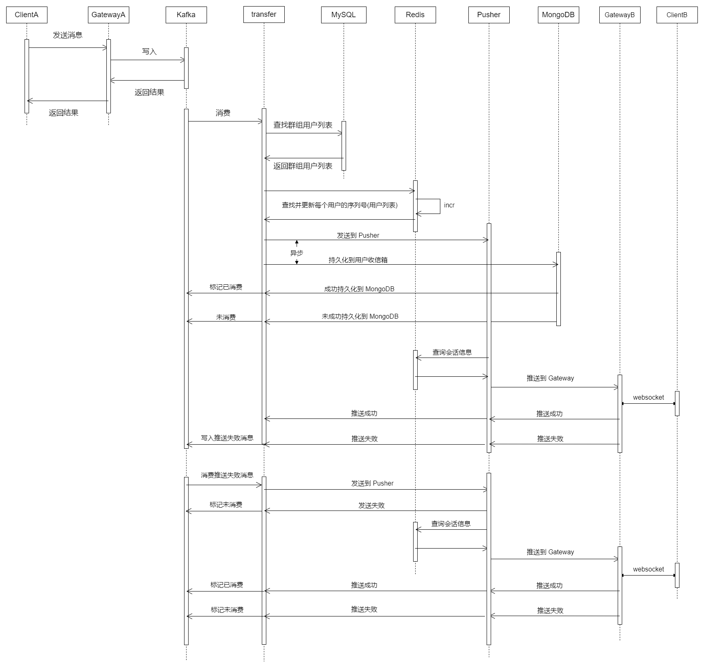
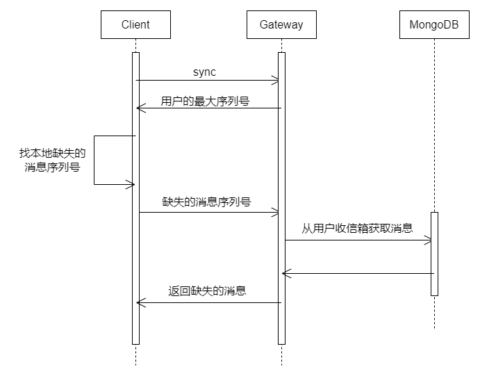
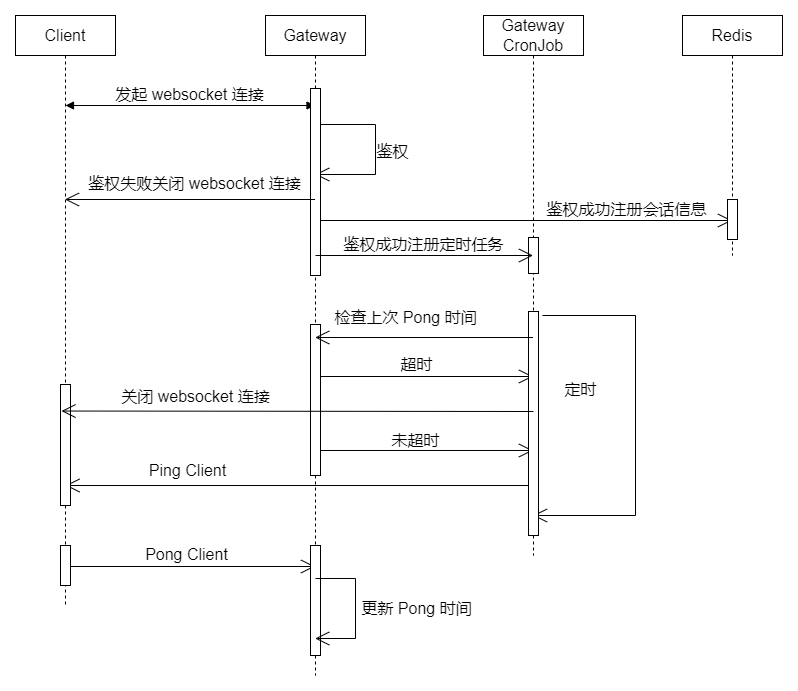

# IM

## 简介

IM 是一个即时通讯服务器. 传输协议为 Websocket. IM 扩展性较好, 无需修改服务端代码即可扩展自定义消息. 通过 IM, 可以快速将即时通讯和网络能力集成到自己的应用中. 

## 安装 IM

> IM 依赖五个开源高性能组件: ETCD, MySQL, MongoDB, Redis 和 Kafka. 私有化部署 IM 前, 请确保五个组件已经安装.

### Docker 部署

TODO

### kubernetes 部署

TODO

## 说明

### 基本组件说明

* ETCD: ETCD 用于 rpc 服务注册与发现.
* MySQL: 存放用户关系.
* MongoDB: 用户消息的离线存储.
* Redis: 存放用户消息序列号, 用户会话信息.
* Kafka: 作为消息传输存储队列.

### 内部服务说明

TODO

### 脚本说明

TODO

## 时序图

### 用户推送消息

### 用户拉取消息

### 用户会话保持

## 架构图

TODO

## 压测报告

TODO
